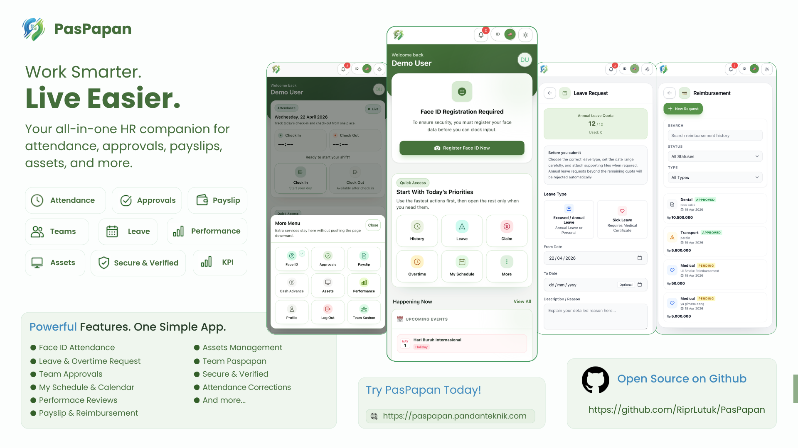

<div align="center">



# PasPapan

Platform manajemen tenaga kerja berbasis Laravel untuk absensi aman, approval, payroll preparation, reporting, aset, dan operasi HR.

[](https://laravel.com)
[](https://livewire.laravel.com)
[](https://tailwindcss.com)
[](https://www.php.net)

</div>

> Dokumentasi utama project ini memakai Bahasa Indonesia.

## Ringkasan

PasPapan adalah aplikasi workforce untuk organisasi yang membutuhkan absensi mobile, workflow HR, approval, persiapan payroll, import/export, reporting, dan maintenance system dalam satu aplikasi Laravel deployable.

Fokus utama aplikasi:

- absensi aman dengan GPS, foto, Face ID, static barcode, dan Dynamic QR
- panel admin untuk karyawan, absensi, cuti, lembur, reimbursement, kasbon, aset, payroll, reports, settings, dan maintenance
- self-service karyawan untuk check-in/out, koreksi absensi, cuti, lembur, reimbursement, slip gaji, dokumen, jadwal, dan approval tim
- import/export background dengan progress run, ringkasan sukses/error, download hasil, dan cleanup otomatis
- wrapper Android berbasis Capacitor untuk kebutuhan APK
- modul enterprise-gated untuk fitur lanjutan tertentu

Detail fitur lengkap ada di [guides/features.md](./guides/features.md).

## Stack

- Laravel `11`
- PHP `8.2+`
- Livewire `3`
- Tailwind CSS `3.4`
- Vite `7`
- MySQL atau MariaDB
- Bun untuk dependency frontend dan build asset
- Pest untuk test suite
- Capacitor untuk wrapper Android

Runtime default aplikasi database-centric:

- `DB_CONNECTION=mysql`
- `QUEUE_CONNECTION=database`
- `CACHE_STORE=database`
- `SESSION_DRIVER=database`
- `FILESYSTEM_DISK=local`
- timezone `Asia/Jakarta`
- locale `id`

## Quick Start

```bash
git clone https://github.com/RiprLutuk/PasPapan.git
cd PasPapan

composer install
bun install
cp .env.example .env
php artisan key:generate
php artisan migrate --seed
php artisan storage:link
```

Jalankan aplikasi:

```bash
php artisan serve
bun run dev
```

Opsional untuk tes background job lokal:

```bash
php artisan queue:work database --queue=maintenance,default
```

## Environment Minimal

```dotenv
APP_NAME=PasPapan
APP_ENV=local
APP_DEBUG=true
APP_URL=http://127.0.0.1:8000

DB_CONNECTION=mysql
DB_HOST=127.0.0.1
DB_PORT=3306
DB_DATABASE=absensi
DB_USERNAME=your_user
DB_PASSWORD=your_password

QUEUE_CONNECTION=database
SESSION_DRIVER=database
CACHE_STORE=database
```

## Deployment

Target produksi paling lengkap adalah VPS karena PasPapan memakai queue worker, scheduler, storage lokal, dan background job.

Panduan deployment dipisahkan di [guides/deployment.md](./guides/deployment.md):

- VPS dengan Nginx/Apache, Supervisor, dan cron
- shared hosting dengan cron fallback
- Vercel memakai [`vercel-community/php`](https://github.com/vercel-community/php) dalam format FAQ

File pendukung Vercel yang sudah tersedia:

- [`vercel.json`](./vercel.json)
- [`api/index.php`](./api/index.php)
- [`api/php.ini`](./api/php.ini)
- [`.env.vercel.example`](./.env.vercel.example)
- [`.vercelignore`](./.vercelignore)

## Operasi

Panduan operasional ada di [guides/operations.md](./guides/operations.md):

- queue dan scheduler
- backup dan maintenance
- import/export run retention
- workflow update
- testing dan quality check
- Android build
- catatan produksi

Command yang paling sering dipakai:

```bash
php artisan queue:work database --queue=maintenance,default --tries=3 --timeout=1800
php artisan schedule:run
php artisan queue:failed
php artisan queue:retry all
php artisan queue:restart
```

## Testing

```bash
php artisan test
./vendor/bin/pest
./vendor/bin/pint
bun run build
```

## Demo

Gunakan platform di sandbox simulasi terbatas.

Link akses: [paspapan.pandanteknik.com](https://paspapan.pandanteknik.com)

| Role | Email Login | Password |
| --- | --- | --- |
| Admin | `admin123@paspapan.com` | `12345678` |
| User | `user123@paspapan.com` | `12345678` |

Anggap kredensial ini hanya untuk demo, bukan kredensial produksi.

## Dukung Pengembangan

Kalau project ini membantu tim Anda dan Anda ingin mendukung pengembangannya, silakan scan QR GoPay berikut.

<div align="center">
  
  <p><strong>GoPay Support</strong></p>
</div>

## Kredit

Berangkat dari fondasi open source yang diprakarsai oleh [Ikhsan3adi](https://github.com/ikhsan3adi), lalu diperluas dan diarahkan ulang ke bentuk produk saat ini oleh [RiprLutuk](https://github.com/RiprLutuk).
